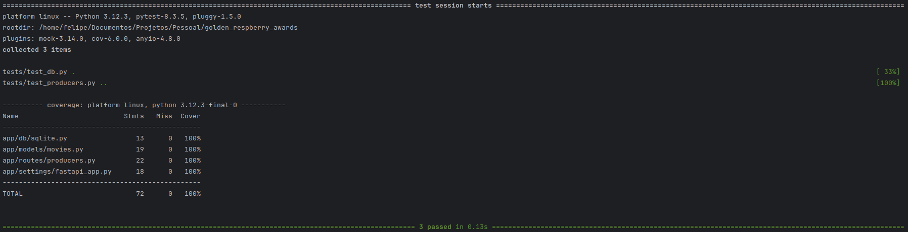
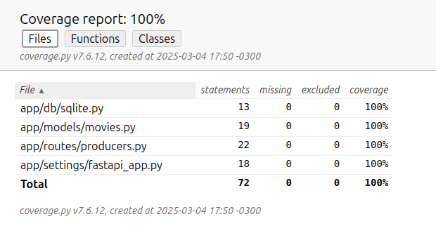
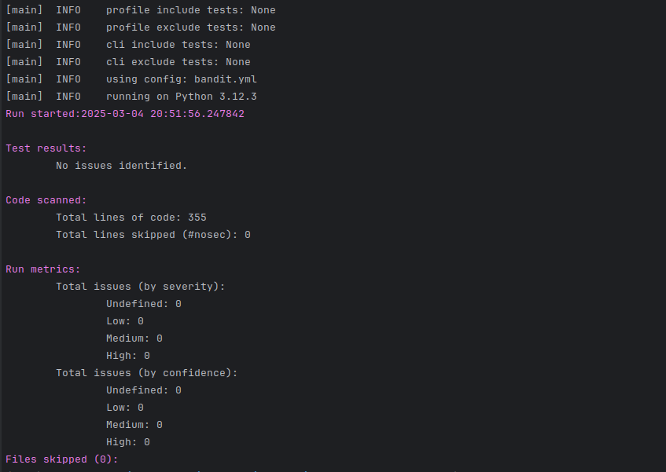
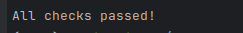

## Introduction
Golden Raspberry Awards is a test-and-learn project that provides information on the producers of 
Golden Raspberry Award-winning films. The application highlights the shortest and longest 
intervals between consecutive wins, offering an analysis of the data for educational and 
experimental purposes.

## Environment Variables

Environment variables are configurable values in the operating system that influence the 
behavior of applications. They store information such as credentials, paths and 
settings without exposing them in the code. In Docker and in applications, they are used 
to parameterize services flexibly and securely.

1. For similar test base H2, leave the URL (Required):
   1. DATABASE_URL=sqlite:///data/awards.sqlite3
2. Do not include these variables in a PRD environment, if you don't want to check your swagger or api documentation:
   1. DOCS=/docs
   2. REDOC=/redoc
   3. OPEN_API_URL=/openapi.json
3. Variable to detect the running environment:
   1. AMBIENT_ENV=DEV 
4. Just to give the system name in the logs.
   1. LOG_NAME=Awards

## Getting Started
Guidance on how to upload the project:

1. Installation process
    1. Create your environment variables according to .env.example.
    2. Container Installatione:
        1. Install all the software dependencies indicated in the project.
        2. After installing the dependencies, run the command.
            1. **`docker-compose`** up or **`docker-compose up -d`**.
   3. Local Installation:
      1. See next chapter for system dependencies.
      2. Create your virtual env.
         1. [Click here to tutorial access ](https://blog.debugeverything.com/pt/ambientes-virtuais-com-python-virtualenv/)
      3. Install project requirements with commands.
         1. `pip install -r requirements.txt` ou `pip3 install -r requirements.txt`.
      4. Running migrations. 
         1. `alembic upgrade head` -> to create and feed the tables with initial data.
         2. For more information read the readme inside migrations in this [site](https://alembic.sqlalchemy.org/en/latest/tutorial.html).
      5. Start the project
         1. `python main.py` or `python3 main.py`

## Software dependencies
Before carrying out the installation, it is necessary to have the following software installed on your machine.

1. Install locally:
    1. [SQLite3](https://www.sqlite.org/)
    2. [Python](https://www.python.org/downloads/release/python-3120/) >= 3.12

2. Installation by container:
    1. [Docker](https://www.docker.com/)
    2. [Docker-Compose](https://docs.docker.com/compose/)
        1. This for install container in development ambient

## Build and Test
Execution of unit  tests.

1. If you are using container follow this instruction.
   1. `docker container ps`
   2. Get code from container id and run the command:
      1. docker exec -it <container-id> /bin/bash -> 
      `container-id` is listed after running the previous command 
2. Make sure venv is enabled if it is locally.   
3. Generate test report from prompt
   1. `pytest --cov`
4. If you're running locally without docker, you can view the tests in the following ways
   1. `pytest --cov=app --cov-report=html or coverage html`
   2. cd htmlcov
   3. python -m http.server

5. Test visualization by terminal:
  
6. Test visualization by interface:

   

Note: Step 3 applies to containers as well as locally.  

## API Documentation
Where the documentation of the api generated by FastApi
can be found, being possible to visualize with the tool running
   1. References
      1. 127.0.0.1:7000/docs 
      2. 127.0.0.1:7000/redoc

## Bandit - Security Linter
Bandit is used to find common security issues in Python code. It analyzes your Python 
code to detect potential security flaws, such as improper handling of sensitive data, 
dangerous use of functions, etc.

1. To run bandit just run the command:
   1. bandit -c bandit.yml -r .
   
      

## Ruff - Python Linter and Formatter
Ruff is a fast Python linter and formatter. It performs static analysis on Python code 
to enforce code style, detect errors, and ensure readability.

1. To run ruff just run the command:
   1. ruff check .

      

## Library Documentations
1. [Alembic](https://alembic.sqlalchemy.org/en/latest/)
2. [Bandit](https://bandit.readthedocs.io/en/latest/)
3. [Coverage](https://coverage.readthedocs.io/en/7.6.12/)
4. [FastApi](https://fastapi.tiangolo.com/)
5. [HTTPX](https://www.python-httpx.org/)
6. [Polars](https://pola.rs/)
7. [PrettyConf](https://prettyconf.readthedocs.io/en/latest/usage.html)
8. [Pydatinc](https://docs.pydantic.dev/latest/)
9. [Pytest](https://docs.pytest.org/en/stable/)
10. [Pytest-cov](https://pytest-cov.readthedocs.io/en/latest/)
11. [Pytest-Mock](https://pytest-mock.readthedocs.io/en/latest/)
12. [Ruff](https://docs.astral.sh/ruff/)
13. [SQLAlchemy](https://www.sqlalchemy.org/)
14. [Uvicorn](https://www.uvicorn.org/)
